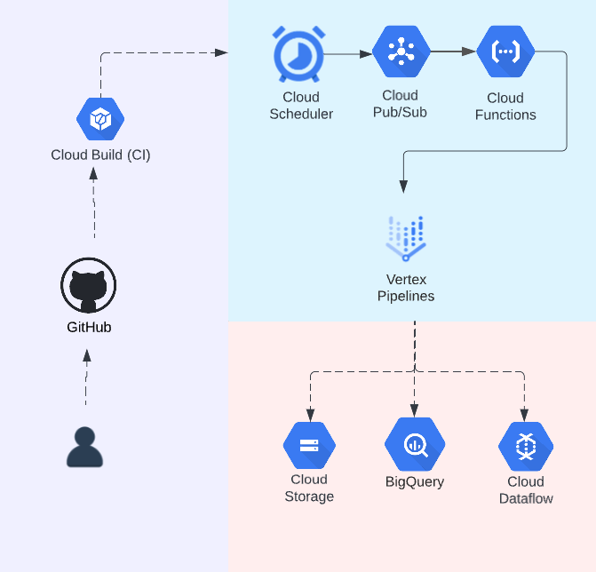
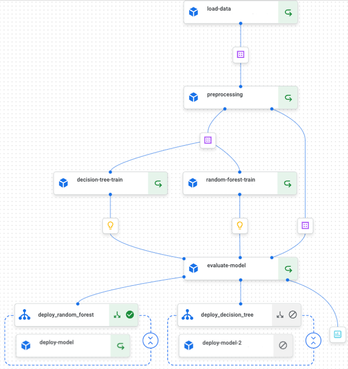

## Vertex AI for ML Workflow using Kubeflow
***
#### Intro
This project demonstrate the use of Vertex AI to simplify the entire ML workflow, from data preparation to model training and deployment. It takes advantage of a centralized data preprocessing, hyperparameter tuning, distributed training, model evaluation and deployment.
- This pipeline trains a decision tree and random forest models to predict the rate of customer conversion on a website (action taken - making a purchase) for revenue boosting.

#### Infrastructure
The project consists of a jupyter notebook with 5 vertex components to
- load data
- preprocess data
- train models
- evaluate model
- deploy models

#### Tools and Technologies
The following tools and technologies will be used in this project:
- GCP
- Google Cloud Vertex AI
- Google Cloud Storage
- Kubeflow
- Bigquery
- Scikit-learn
- Pandas
- Yaml

#### Usage
Run the jupyter notebook with the right config variables to test run

    

    

