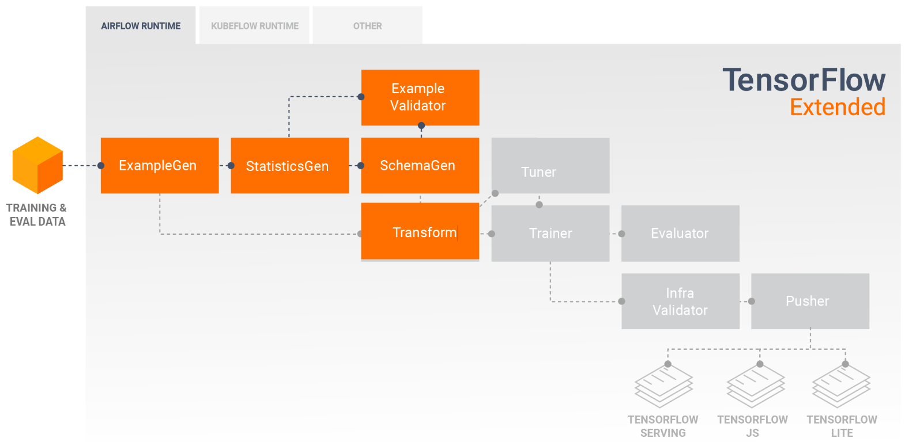

## TFDV_Anomaly_Correction

Using Tensorflow Data Validation components (ExampleGen, StatisticsGen, SchemaGen and ExampleValidator) to ingest data, analyze the data for statistics and schema generation, and anomaly detection.

    

