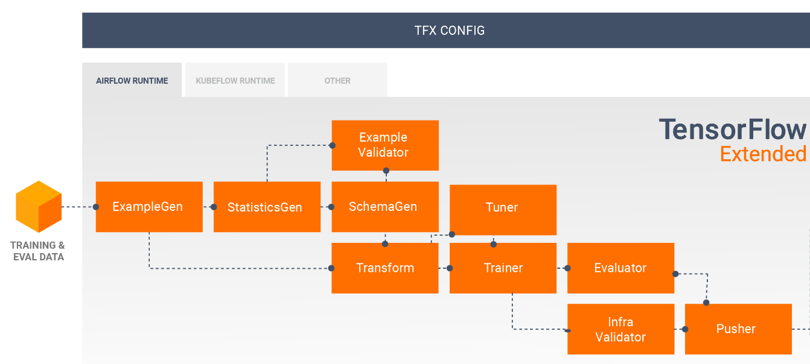

## TFX_Interactive_Orchestration
Using TensorTFX interactive pipeline to execute all components for an-end-to-end workflow.

- The model is trained to predict forest cover type from cartographic variables such as elevation, slope, hillshade and soil type

    

