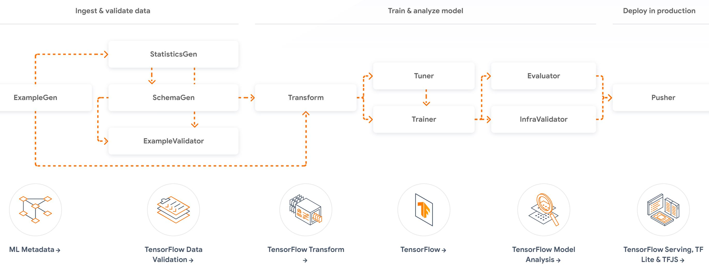

## TFX Orchestrating for ML Pipeline
***
#### Intro
TFX (TensorFlow Extended) is a framework for building end-to-end machine learning pipelines that leverages the power of TensorFlow. TFX provides a set of components that can be assembled to create a complete machine learning workflow, including data ingestion, data validation, training, evaluation, and serving.

One of the key features of TFX is its ability to orchestrate the different components of the machine learning pipeline. 

#### Infrastructure
The project consists of a jupyter notebook file which shows the execution of the ML pipeline execution alongside two files which defines the transform and model training functions.
- The pipeline is orchestrated using tfx-dsl command interface.

#### Tools and Technologies
The following tools and technologies will be used in this project:
- Tensorflow
- TFX
- TFDV
- TFMA
- TFT
- Scikit-learn
- Pandas

#### Usage
The entire workflow is defined using TFX. This will involve defining the workflow as a series of tasks in TFX components.

    

