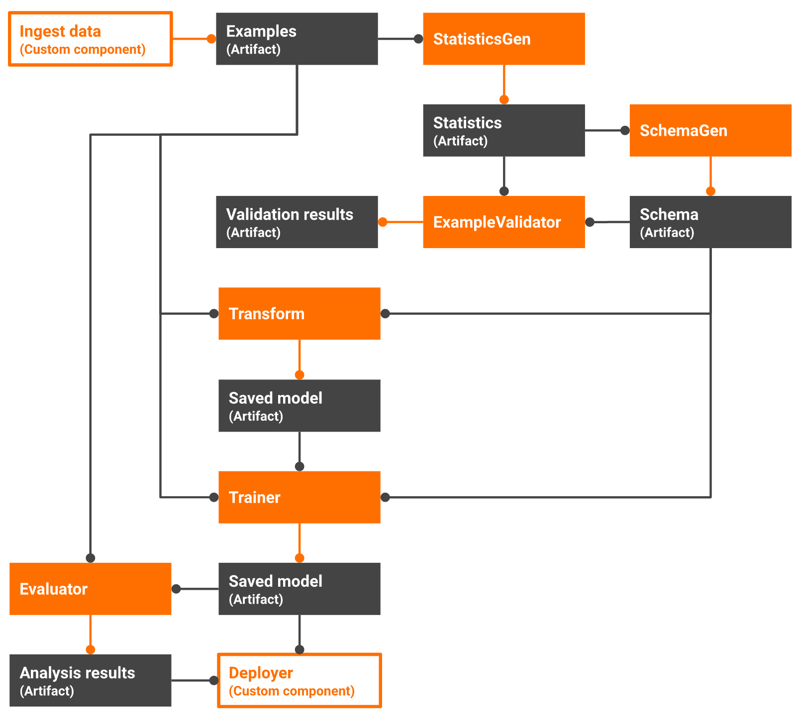

## TFX_Orchestration_Pipeline
The entire workflow is defined using TFX - tfx-dsl command interface for orchestrating tfx components as workflow pipeline.

- The model is trained to predict the species of penguin based on physical characteristics.

    

