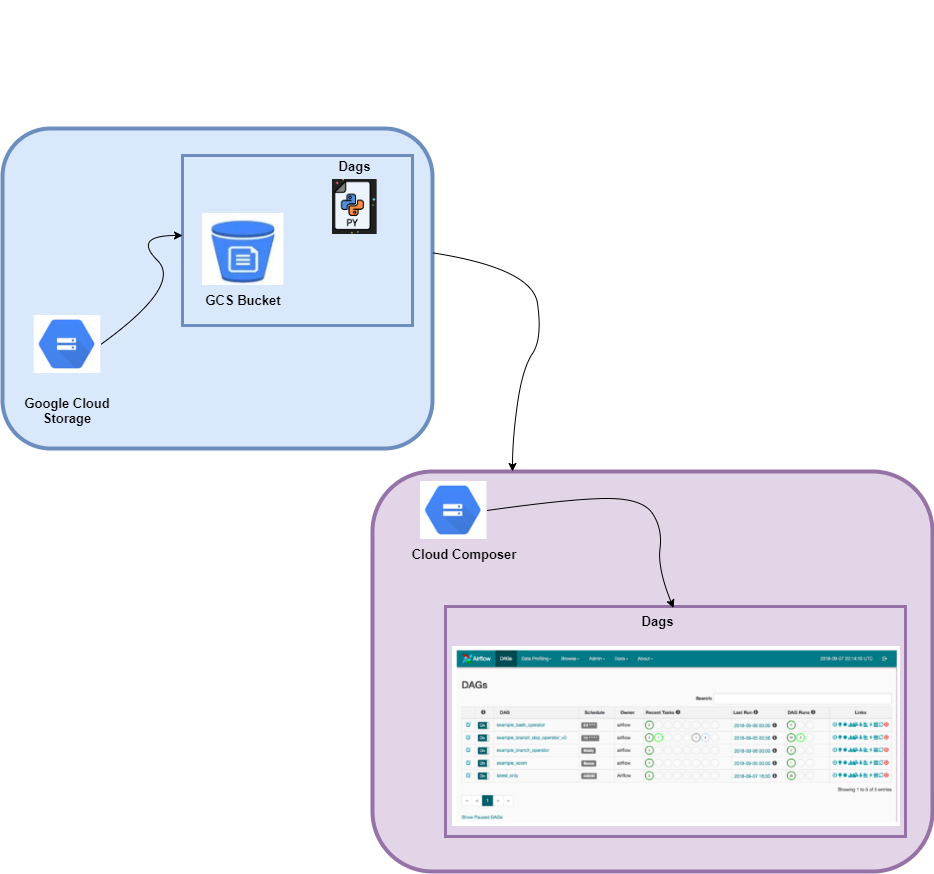

## Airflow and Cloud Composer
***
#### Intro
This project demonstrate the use of Apache Airflow and Google Cloud Composer for orchestrating machine learning workflows. The goal is to showcase the benefits of using a workflow management system for managing the end-to-end lifecycle of machine learning models. The project will cover tasks such as data inception, processing, feature engineering, model training, and evaluation - which could then be deployed.

#### Infrastructure
The project consists of the 3 folders
- Dags: Conataining the airflow tasks, where each task is defined as dags performed in a sequential manner, with the output of one task serving as the input to the next.
- Script: A folder containing python logic where the defined tasks are written for data loading and processing, Feature Engineering, Model Training and evaluation
- Data: where the training data is located

#### Tools and Technologies
The following tools and technologies will be used in this project:
- Apache Airflow
- Google Cloud Composer
- Google Cloud Storage
- TensorFlow
- Scikit-learn
- Pandas
- Yaml

#### Usage
The entire workflow will be automated using Apache Airflow and Google Cloud Composer. This will involve defining the workflow as a series of tasks, and configuring each task to run automatically in response to specific events or conditions. To take advantage of scalbility in the cloud, the dags are defined in associated GCS buckets and excuted in composer airflow automatically. The running dags can be viewed in the airflow web UI page.

