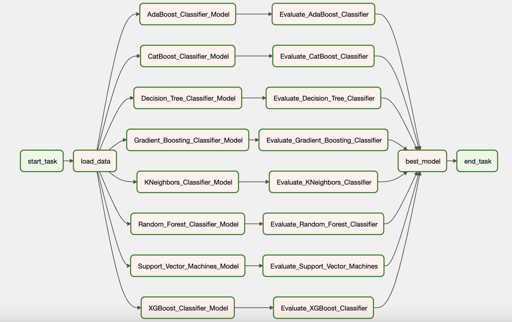

## MLOps Projects
- Displaying practices, tools and implementation that aims to deploy and maintain machine learning models in production reliably and efficiently. 
***

### Table of Contents
***
1. [Project Overview](#1-project-overview)
2. [Airflow & Cloud Composer](#2-airflow-and-cloud-composer)
3. [TFX](#3-tfx)
4. [Kubeflow Pipelines with GCP Vertex AI](#4-kubeflow-pipelines-with-gcp-vertex-ai)

***
### 1 Project Overview

This project focuses on streamlining the machine learning model development process by implementing MLOps best practices and tools. The goal is to ensure that models are developed in a sustainable, scalable, and repeatable manner. The project is defined as config-based.

- Three projects are described here with diffrent ML orchestrating and pipline tools/platform (Airflow, TFX and Vertex AI)
***

### 2 Airflow and Cloud Composer
#### Intro
This project demonstrate the use of Apache Airflow and Google Cloud Composer for orchestrating machine learning workflows. The goal is to showcase the benefits of using a workflow management system for managing the end-to-end lifecycle of machine learning models. The project will cover tasks such as data inception, processing, feature engineering, model training, and evaluation - which could then be deployed.

#### Infrastructure
The project consists of the 3 folders
- Dags: Conataining the airflow tasks, where each task is defined as dags performed in a sequential manner, with the output of one task serving as the input to the next.
- Script: A folder containing python logic where the defined tasks are written for data loading and processing, Feature Engineering, Model Training and evaluation
- Data: where the training data is located

#### Tools and Technologies
The following tools and technologies will be used in this project:
- Apache Airflow
- Google Cloud Composer
- Google Cloud Storage
- TensorFlow
- Scikit-learn
- Pandas
- Yaml

#### Usage
The entire workflow will be automated using Apache Airflow and Google Cloud Composer. This will involve defining the workflow as a series of tasks, and configuring each task to run automatically in response to specific events or conditions. To take advantage of scalbility in the cloud, the dags are defined in associated GCS buckets and excuted in composer airflow automatically. The running dags can be viewed in the airflow web UI page.

***
### 3 TFX
#### Intro
This project demonstrate the use of TensorFlow Extended (TFX) for orchestrating machine learning workflows. The goal is to showcase the benefits of using TFX for managing the end-to-end lifecycle of machine learning models.

#### Infrastructure

The project utilizes all of TFX' components for data loading, processing, Feature Engineering, Model Training, evaluation, deployment, monitoring and validation. By automating the entire lifecycle of machine learning models, the project will showcase the efficiency and scalability gains that can be achieved through the use of TFX.

#### Tools and Technologies
The following tools and technologies will be used in this project:
- TensorFlow Extended (TFX)
- TensorFlow
- Apache Beam
- TensorBoard

#### Usage
The project is executed by running the main script via `python main.py` 

***
### 4 Kubeflow Pipelinees with GCP Vertex AI
#### Intro
This project demonstrate the use of Kubeflow Pipelines and Google Cloud Vertex AI for orchestrating machine learning workflows. The goal is to showcase the benefits of using these tools for managing the end-to-end lifecycle of machine learning models. The project will cover the automation of tasks such as data processing, feature engineering, model training, deployment, and monitoring.

#### Infrastructure
showcase the efficiency and scalability gains that can be achieved through the use of these tools.

#### Tools and Technologies
The following tools and technologies will be used in this project:
- Kubeflow Pipelines
- Google Cloud Vertex AI
- TensorFlow
- Google Cloud Storage
- Google Cloud AI Platform
- TensorBoard

#### Usage

